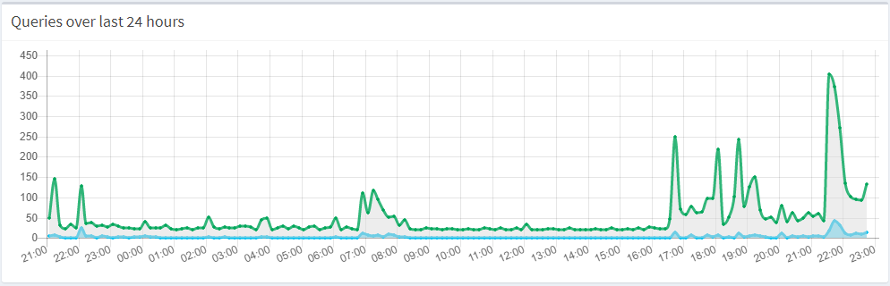
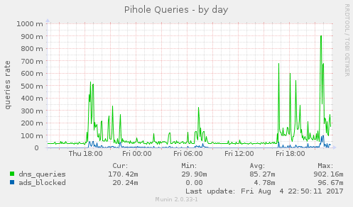
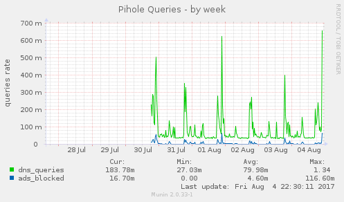
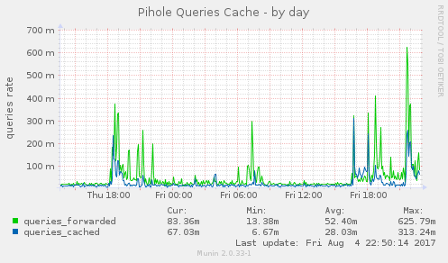
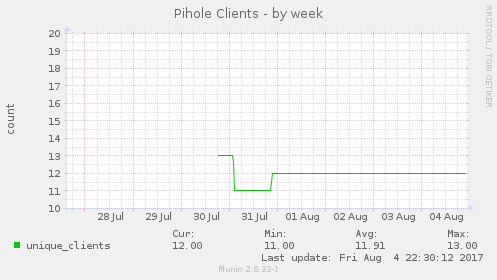

# MuninPiholePlugins
Munin plugins for monitoring Pi-hole (tested with Pi-hole v3.1.4 - https://pi-hole.net)

## Plugins
* `pihole_queries` show the queries rates (total dns queries and blocked queries/ads rates). The daily graph from this plugin should have a curve pace very similar to the one from the Pi-hole web interface.
* `pihole_cache` shows the queries cache rates (forwarded and cached queries rates)
* `pihole_clients` shows the unique clients statistics (counter which is resetted every day). 

## Configuration

The Pi-hole web interface need to be installed in order to have the plugins working (they use the web interface api).

Sample setup for '/etc/munin/plugin-conf.d/munin-node':
```
[pihole_*]
user root
env.host 127.0.0.1
env.port 80
env.api /admin/api.php
```

## Samples

### Graphs

**Queries graph in Pi-hole:**



**Queries graph in Munin (daily):**



**Queries graph in Munin (weekly):**



**Cache graph in Munin (daily):**



**Clients graph in Munin (weekly):**



